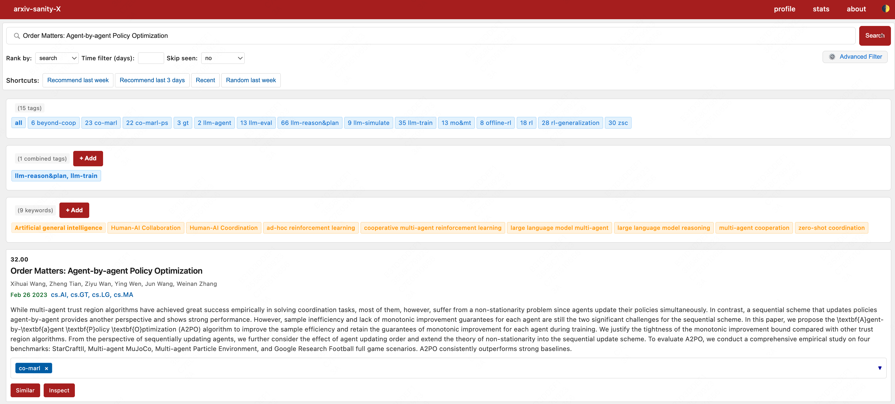

# arxiv-sanity-X

[中文](README_CN.md) | [English](README.md)

A comprehensive arXiv paper browsing and recommendation system featuring AI-powered summarization, hybrid search capabilities, and personalized recommendations. Built with modern ML techniques including TF-IDF, semantic embeddings, and LLM integration.



## 📋 Table of Contents

### Getting Started

- [Core Overview](#-core-overview)
- [Quick Start](#-quick-start)
- [Docs](#docs)

### Usage

- [User Guide](#-user-guide)
- [AI Paper Summarization](#-ai-paper-summarization)
- [Advanced Features](#-advanced-features)

### Configuration

- [Configuration Guide](#configuration-guide)
- [Prerequisites & OS Notes](#-prerequisites--os-notes)

### Operations

- [Data Layout & Migration](#-data-layout--migration)
- [Deployment & Security](#-deployment--security-notes)
- [Troubleshooting](#-troubleshooting)

### Development

- [Tech Stack](#-tech-stack)
- [Project Structure](#-project-structure)
- [Architecture](#architecture)
- [API Reference](#-api-reference)
- [Development Guide](#-development-guide)

### Other

- [Changelog](#-changelog)
- [Acknowledgments](#-acknowledgments)

---

## Docs

- Entry point: [docs/INDEX.md](docs/INDEX.md)
- Operations: [docs/OPERATIONS.md](docs/OPERATIONS.md)
- Security: [docs/SECURITY.md](docs/SECURITY.md)
- Development: [docs/DEVELOPMENT.md](docs/DEVELOPMENT.md)
- Contributing: [CONTRIBUTING.md](CONTRIBUTING.md)
- Security policy: [SECURITY.md](SECURITY.md)

## 🎯 Core Overview

arxiv-sanity-X is a personal research workbench for tracking arXiv papers. It combines (1) reliable paper ingestion, (2) fast search, and (3) feedback-driven recommendations, so you can quickly find what matters, save it, and keep up daily.

### Key Capabilities

| Feature                           | Description                                                                |
| --------------------------------- | -------------------------------------------------------------------------- |
| 🔍 **Multi-mode Search**          | Keyword (TF-IDF), semantic (Embedding), hybrid search with tunable weights |
| 🎯 **Smart Recommendations**      | SVM classifiers trained on positive/negative feedback tags                 |
| 🤖 **AI Summaries**               | HTML/PDF parsing + LLM-generated structured summaries, multi-model support |
| 🏷️ **Tag System**                 | Positive/negative feedback, combined tags, keyword tracking, reading list  |
| 📧 **Email Recommendations**      | Automated daily recommendation emails with holiday-aware scheduling        |
| 🔄 **Automation**                 | Built-in scheduler: fetch → compute → summarize → email                    |
| 📤 **PDF Uploads (Experimental)** | Upload private PDFs for parsing, summaries, and similarity search          |

## 🛠️ Tech Stack

### Backend

- **Framework**: Flask with Blueprint-based modular architecture
- **Database**: SQLite with custom KV store (WAL mode, compression support)
- **Task Queue**: Huey (SQLite backend) for async summary generation
- **Configuration**: pydantic-settings for type-safe config management
- **Real-time**: Server-Sent Events (SSE) for live updates

### Frontend

- **Templates**: Jinja2 with responsive HTML/CSS
- **JavaScript**: Vanilla JS with esbuild bundling
- **Rendering**: MathJax for LaTeX, markdown-it for Markdown
- **Build**: esbuild with content-hash caching

### ML/AI

- **Search**: TF-IDF (scikit-learn) + semantic embeddings (Ollama/OpenAI API)
- **Recommendations**: SVM classifiers trained on user feedback
- **Summarization**: OpenAI-compatible LLM APIs
- **PDF Parsing**: MinerU (API or local VLM)

### Infrastructure

- **Web Server**: Gunicorn with multi-worker support
- **Scheduler**: APScheduler for automated pipelines
- **Services**: LiteLLM gateway, Ollama embeddings, MinerU VLM

## 📁 Project Structure

```
arxiv-sanity-x/
├── serve.py              # Flask entry point
├── tasks.py              # Huey task definitions
│
├── backend/              # Flask application
│   ├── app.py            # App factory & initialization
│   ├── blueprints/       # Route handlers (10 blueprints)
│   │   ├── web.py        # Page routes (/, /summary, /profile, etc.)
│   │   ├── api_user.py   # Login/logout, user state, email registration
│   │   ├── api_search.py # Search endpoints
│   │   ├── api_summary.py# Summary generation & status
│   │   ├── api_tags.py   # Tag management
│   │   ├── api_papers.py # Paper data & images
│   │   ├── api_readinglist.py # Reading list
│   │   ├── api_uploads.py# Upload PDFs + parsing/extract/similarity
│   │   ├── api_sse.py    # Server-Sent Events
│   │   └── metrics.py    # /metrics (Prometheus, optional)
│   ├── services/         # Business logic layer
│   │   ├── data_service.py    # Cache & data management
│   │   ├── search_service.py  # TF-IDF, semantic, hybrid search
│   │   ├── summary_service.py # Summary generation & caching
│   │   ├── semantic_service.py# Embedding & vector search
│   │   └── ...
│   ├── schemas/          # Pydantic request/response models
│   └── utils/            # Helpers (cache, SSE, manifest)
│
├── aslite/               # Data layer
│   ├── db.py             # SqliteKV wrapper & DB access
│   ├── repositories.py   # Repository pattern for data access
│   └── arxiv.py          # arXiv API client
│
├── config/               # Configuration
│   ├── settings.py       # pydantic-settings definitions
│   ├── cli.py            # Config CLI tool
│   └── llm.yml           # LiteLLM gateway config
│
├── tools/                # CLI tools & automation
│   ├── arxiv_daemon.py   # Paper fetching from arXiv
│   ├── compute.py        # TF-IDF & embedding computation
│   ├── daemon.py         # Scheduled task runner
│   ├── batch_paper_summarizer.py # Batch summary generation
│   ├── paper_summarizer.py # Single paper summarizer
│   └── send_emails.py    # Email recommendations
│
├── bin/                  # Service launchers
│   ├── run_services.py   # One-command multi-service launcher
│   ├── up.sh             # Gunicorn startup script
│   ├── huey_consumer.py  # Huey consumer wrapper (memory limit + worker role)
│   ├── embedding_serve.sh# Ollama embedding server
│   ├── mineru_serve.sh   # MinerU VLM server
│   └── litellm.sh        # LiteLLM gateway
│
├── static/               # Frontend assets
│   ├── *.js              # Source JavaScript files
│   ├── css/              # Stylesheets
│   ├── lib/              # Third-party libraries
│   └── dist/             # Built assets (gitignored)
│
├── templates/            # Jinja2 HTML templates
├── scripts/              # Build & maintenance scripts
├── tests/                # Test suite
├── data/                 # Runtime data (gitignored)
│   ├── papers.db         # Paper metadata
│   ├── dict.db           # User data (tags, keywords, etc.)
│   ├── features.p        # Computed features
│   ├── huey.db           # Huey task queue DB (SQLite)
│   ├── uploads/          # Uploaded PDFs + metadata
│   └── summary/          # Cached summaries
└── data-repo/            # Optional git submodule for backing up data/dict.db
```

## 🧭 User Guide

This section covers how to use the arxiv-sanity-X website. Most workflows start from the homepage.

### 1) Sign in

- Click **Profile** in the top-right corner to access your profile page
- Enter a username to log in (no password required, suitable for personal/intranet use)
- If you plan to expose the site publicly, put it behind authentication/VPN and set a stable `ARXIV_SANITY_SECRET_KEY` (recommended; `secret_key.txt` is a local fallback and must not be committed)
- (Optional) Register notification emails on the Profile page. Multiple addresses are supported (comma/whitespace/newline separated). Submit an empty value to clear.

### 2) Browse and Search Papers

**Homepage Features:**

- Papers are displayed by time (newest first) by default
- Click paper title to view details, click arXiv link to open original
- Use the search box at the top (keyboard shortcut: `Ctrl+K`)

**Search Syntax:**
| Syntax | Example | Description |
| -------- | ------------------------ | ------------------------------------ |
| Title | `ti:transformer` | Search titles containing transformer |
| Author | `au:goodfellow` | Search by author |
| Category | `cat:cs.LG` | Search specific arXiv category |
| ID | `id:2312.12345` | Find by arXiv ID |
| Phrase | `"large language model"` | Exact phrase match |
| Exclude | `-survey` or `!survey` | Exclude results containing the term |

**Search Mode Toggle:**

- **keyword**: Fastest, TF-IDF based, no extra services required
- **semantic**: Vector similarity based, requires Embedding enabled
- **hybrid**: Combines keyword + semantic, adjustable weight (recommended)

**Homepage Filter Rules:**

- If you type a search query, the UI and backend keep ranking in query-compatible modes (`search` or `time`)
- Advanced fields such as **Tags**, **PIDs**, **Logic**, and **SVM C** only apply when **Rank by** is `tags` or `pid`
- Tag inputs in advanced filters support inline suggestions and keyboard selection

### 3) Tagging System and Personalized Recommendations

**Adding Tags:**

- Click the **+** button on paper cards to add tags
- Supports positive tags (like) and negative tags (dislike)
- Tags train your personal SVM recommendation model

**Using Tag Recommendations:**

- Select **Tags** sort mode on the homepage
- Choose one or more tags, system will recommend similar papers
- Combined tags (e.g., `RL,NLP`) enable intersection recommendations

### 4) AI Paper Summaries

- Click a paper to enter detail page, click **Summary** button
- First generation requires LLM processing (typically 10-30 seconds)
- Results are cached, subsequent visits display instantly
- Switch between different LLM models to regenerate
- Clear current model cache or all caches as needed

### 5) Reading List

- Click the bookmark/reading-list button on paper cards to add papers to your reading list
- Visit `/readinglist` page to manage your reading list
- Useful for batch summarization or read-later queuing
- The reading list page mirrors the main paper-card actions, including Similar / Inspect / Summary links and private upload actions

### 6) Other Features

- **Stats page**: View paper statistics, daily addition charts
- **About page**: View system info, supported arXiv categories
- **Email recommendations**: Receive daily recommendations after configuring SMTP (see Configuration Guide)

## 📦 Data Layout & Migration

By default, data is stored under `data/` (configured by `ARXIV_SANITY_DATA_DIR` in `.env` / `config/settings.py`):

- `data/papers.db`: fetched papers + metadata
- `data/dict.db`: user data (tags, negative tags, keywords, reading list, email registry, summary status)
- `data/features.p`: TF‑IDF / hybrid features generated by [tools/compute.py](tools/compute.py)
- `data/summary/`: cached LLM summaries
- `data/pdfs/`, `data/mineru/`, `data/html_md/`: intermediate caches for parsing
- `data/uploads/`: uploaded private PDFs and derived artifacts (if you use uploads)
- `data/huey.db`: Huey task queue database
- `data/sse_events.db`: SSE cross-process event bus (SQLite, when enabled)
- `data-repo/` (optional): git submodule used by the daemon to back up `data/dict.db`

To migrate to a new machine, you typically copy at least:

- `data/papers.db`
- `data/dict.db`
- `data/features.p` (or regenerate it by running [tools/compute.py](tools/compute.py))
- `data/summary/` (optional, if you want to keep cached summaries)

If you use git backup via `data-repo/`, you can also restore from:

- `data-repo/dict.db`

To use `data-repo/` backup with the daemon:

1. Initialize the submodule: `git submodule update --init --recursive`
2. `ARXIV_SANITY_DAEMON_ENABLE_GIT_BACKUP=true` is already the default; set it to `false` if you want to disable backups
3. If you do not want remote pushes, set `ARXIV_SANITY_DAEMON_BACKUP_PUSH=false`; otherwise ensure `data-repo/` has a valid git remote and your runtime environment can `git push`

## 🔐 Deployment & Security Notes

- The built-in login is **username only** (no password). This is intended for personal / trusted environments.
- If you deploy on a public server, protect it behind authentication/VPN/reverse-proxy, and set a stable secret key via `ARXIV_SANITY_SECRET_KEY` or `secret_key.txt`.
- Do not commit your API keys. Prefer environment variables in `.env` or your shell environment.

## 🧩 Troubleshooting

- **The website is empty / no papers**: you likely didn’t run [tools/arxiv_daemon.py](tools/arxiv_daemon.py) + [tools/compute.py](tools/compute.py) yet.
- **Summaries always fail**: check `ARXIV_SANITY_LLM_API_KEY`, `ARXIV_SANITY_LLM_BASE_URL`, `ARXIV_SANITY_LLM_NAME` in `.env`.
- **Summary doesn’t start generating**: the Summary page will not auto-enqueue jobs on cache misses; click **Generate**. Ensure a Huey consumer is running (recommended: `python bin/run_services.py`, or run only the consumer with `python bin/huey_consumer.py tasks.huey -w 4 -k thread`).
- **Semantic/hybrid search has no effect**: ensure embeddings are enabled and you regenerated features with [tools/compute.py](tools/compute.py) (for hybrid features).
- **Time-sorted lists look wrong / slow**: rebuild the metadata time index: `python -m tools rebuild_time_index`.
- **MinerU errors**:
    - API backend: check `ARXIV_SANITY_MINERU_API_KEY`
    - local backend: check `ARXIV_SANITY_MINERU_BACKEND` and that the service is reachable on `ARXIV_SANITY_MINERU_PORT`
- **Stuck jobs after crash (locks)**: run [scripts/cleanup_locks.py](scripts/cleanup_locks.py) or tune `ARXIV_SANITY_SUMMARY_LOCK_STALE_SEC` / `ARXIV_SANITY_MINERU_LOCK_STALE_SEC`.
- **Stuck/ghost summary tasks (Huey)**: dry-run `python scripts/cleanup_tasks.py`, then rerun with `--force` (optionally `--flush-huey` to clear the entire queue). Use with care.
- **Cannot load features.p due to NumPy mismatch**: regenerate features by rerunning [tools/compute.py](tools/compute.py) under the current environment.
- **Gunicorn WORKER TIMEOUT / SIGKILL**: if logs show `WORKER TIMEOUT`, increase Gunicorn timeout (e.g. `ARXIV_SANITY_GUNICORN_EXTRA_ARGS="--timeout 600 --graceful-timeout 600"`), and avoid too many worker processes when caches are enabled. `bin/up.sh` auto-selects `gevent` for SSE and adds generous timeouts by default.
- **Gevent MonkeyPatchWarning (ssl/urllib3)**: this typically happens with `--preload`. If you still see it, try `ARXIV_SANITY_GUNICORN_PRELOAD=false` or force `ARXIV_SANITY_GUNICORN_WORKER_CLASS=gthread`.
- **Real-time updates not working (SSE)**: check `ARXIV_SANITY_SSE_ENABLED=true` and inspect `GET /api/sse_stats` for per-process queue/bus status.

## ⚡ Quick Start

This project is “batteries included” for the web app, but it relies on **external model services** (LLM / embedding / MinerU) that you must choose and configure.

### Recommended Setup Profiles

Pick one profile first, then follow the steps below.

| Profile                | What you get                                     | Requires                        | Recommended for                 |
| ---------------------- | ------------------------------------------------ | ------------------------------- | ------------------------------- |
| **Minimal (LLM-only)** | Browse, search (TF‑IDF), LLM summaries           | LLM API key                     | First-time users / low resource |
| **Hybrid Search**      | TF‑IDF + embeddings hybrid search                | LLM API key + embedding backend | Better relevance                |
| **Full (MinerU)**      | Strong PDF-to-Markdown parsing (tables/formulas) | MinerU backend (API or local)   | Best summary fidelity           |

### 1. Installation

```bash
# Clone and install
git clone https://github.com/xihuai18/arxiv-sanity-x && cd arxiv-sanity-x
pip install -r requirements.txt
npm install
```

### 2. Create Configuration Files

```bash
# Required: Create .env from template
cp .env.example .env

# Optional: Create LiteLLM config (if using multi-model gateway)
cp config/llm_template.yml config/llm.yml
```

### 3. Configure Essential Settings

Edit `.env` with your settings (created from [.env.example](.env.example)).

At minimum, you should review **LLM settings**, and (optionally) **summary source / embedding / MinerU**:

```bash
# LLM API example (Required for paper summaries)
ARXIV_SANITY_LLM_BASE_URL=https://openrouter.ai/api/v1
ARXIV_SANITY_LLM_API_KEY=your-api-key
ARXIV_SANITY_LLM_NAME=deepseek/deepseek-chat-v3.1:free  # Example provider model, not the code default
ARXIV_SANITY_LLM_SUMMARY_LANG=zh

# Web
ARXIV_SANITY_HOST=http://localhost:55555
ARXIV_SANITY_SERVE_PORT=55555

# Summary source (HTML is fast & default)
ARXIV_SANITY_SUMMARY_MARKDOWN_SOURCE=html
ARXIV_SANITY_SUMMARY_HTML_SOURCES=ar5iv,arxiv

# Runtime tuning (Optional, recommended for stability)
#
# Daemon: prevent permanent hangs on stuck subprocesses (2 hours)
# ARXIV_SANITY_DAEMON_SUBPROCESS_TIMEOUT_S=7200
#
# SSE IPC (SQLite-backed, cross-process)
# ARXIV_SANITY_SSE_ENABLED=true
# ARXIV_SANITY_SSE_QUEUE_MAXSIZE=200
# ARXIV_SANITY_SSE_PUBLISH_RETRY_QUEUE_MAXSIZE=2000
# ARXIV_SANITY_SSE_PUBLISH_RETRY_BACKOFF_MAX_S=1.0
# ARXIV_SANITY_SSE_PUBLISH_ASYNC=true
#
# Cache refresh throttling (serve stale cache while refreshing)
# ARXIV_SANITY_DATA_CACHE_REFRESH_MIN_INTERVAL=60
# ARXIV_SANITY_FEATURES_CACHE_REFRESH_MIN_INTERVAL=300
# # Readiness checks used by launchers and health probes
# ARXIV_SANITY_READY_REQUIRE_EMBEDDING=true
# ARXIV_SANITY_READY_REQUIRE_MINERU=true
#
# Gunicorn (bin/up.sh auto-selects gevent when SSE is enabled and gevent is installed)
# ARXIV_SANITY_GUNICORN_WORKER_CLASS=gevent
# ARXIV_SANITY_GUNICORN_EXTRA_ARGS="--timeout 600 --graceful-timeout 600"
# ARXIV_SANITY_GUNICORN_FORCE_WORKERS=1

# Email (Optional, for daily recommendations)
ARXIV_SANITY_EMAIL_FROM_EMAIL=your_email@mail.com
ARXIV_SANITY_EMAIL_SMTP_SERVER=smtp.mail.com
ARXIV_SANITY_EMAIL_SMTP_PORT=465
ARXIV_SANITY_EMAIL_USERNAME=username
ARXIV_SANITY_EMAIL_PASSWORD=your-password

# Internal API key (Optional, for scripts calling APIs without a browser session)
# ARXIV_SANITY_RECO_API_KEY=your-internal-key

# Embeddings (Optional)
# ARXIV_SANITY_EMBED_USE_LLM_API=false
# ARXIV_SANITY_EMBED_MODEL_NAME=qwen3-embedding:0.6b

# MinerU (Optional)
# ARXIV_SANITY_MINERU_ENABLED=false
# ARXIV_SANITY_MINERU_BACKEND=api
# ARXIV_SANITY_MINERU_API_KEY=your-mineru-api-key
```

Also check the arXiv categories configured via `ARXIV_SANITY_ARXIV_CORE_TAGS`, `ARXIV_SANITY_ARXIV_LANG_TAGS`, `ARXIV_SANITY_ARXIV_AGENT_TAGS`, and `ARXIV_SANITY_ARXIV_APP_TAGS`.
If you want automated fetch/compute/summary/email, remember that daemon is not started automatically; use `python -m tools daemon` or `python bin/run_services.py --with-daemon`.

### 4. Verify Configuration

```bash
# Show current configuration
python -m config.cli show

# Validate configuration
python -m config.cli validate

# Diagnose common operator mistakes
python -m config.cli doctor
```

### 5. Fetch Papers and Start

```bash
# Fetch papers and compute features
python -m tools arxiv_daemon -n 10000 -m 500
python -m tools compute --num 20000

# Start all services (one command)
python bin/run_services.py

# Visit http://localhost:55555
```

### Service Startup Options

Choose the startup method based on your needs:

#### Option 1: Minimal Startup (Web Only)

```bash
# Development mode
# Build frontend assets first if static/dist is missing
npm run build:static
# Set ARXIV_SANITY_RELOAD=true if you want auto-reload
python serve.py

# Production mode (Gunicorn)
bash bin/up.sh
```

#### Option 2: One-Command Startup (Recommended)

```bash
# Start Web + Huey + optional services (Embedding/MinerU/LiteLLM)
python bin/run_services.py

# Common options
python bin/run_services.py --no-embed      # Skip Embedding service
python bin/run_services.py --no-mineru     # Skip MinerU service
python bin/run_services.py --no-litellm    # Skip LiteLLM gateway
python bin/run_services.py --with-daemon   # Include scheduler daemon
```

`python bin/run_services.py` does not start the daemon by default. If you want automated fetch/compute/summary/email, add `--with-daemon` or run `python -m tools daemon` separately.

#### Option 3: Start Services Separately

```bash
# Terminal 1: Web service
bash bin/up.sh

# Terminal 2: Embedding service (optional)
./bin/embedding_serve.sh

# Terminal 3: MinerU service (optional)
./bin/mineru_serve.sh

# Terminal 4: LiteLLM gateway (optional)
./bin/litellm.sh

# Terminal 5: Huey worker (required for async jobs)
python bin/huey_consumer.py tasks.huey -w 4 -k thread

# Terminal 6: Scheduler daemon (optional)
python -m tools daemon
```

#### Option 4: One-Time Data Initialization

```bash
# Only fetch papers and compute features, don't start services
python bin/run_services.py --fetch-compute 10000
```

> **Note**: If you need the full stack (embedding / minerU / litellm) in one terminal, use [bin/run_services.py](bin/run_services.py). Note that it calls bash scripts (see OS notes below).

### Configuration Checklist

| Item                  | File/Location        | Required       | Description                                                                      |
| --------------------- | -------------------- | -------------- | -------------------------------------------------------------------------------- |
| **Core Config**       | [.env](.env.example) | ✅ Yes         | All settings via environment variables                                           |
| **LLM Provider**      | `.env`               | ✅ Yes         | `ARXIV_SANITY_LLM_BASE_URL`, `ARXIV_SANITY_LLM_NAME`, `ARXIV_SANITY_LLM_API_KEY` |
| **arXiv Categories**  | `.env`               | ⚙️ Important   | `ARXIV_SANITY_ARXIV_*` controls what you fetch & show                            |
| **Summary Source**    | `.env`               | ⚙️ Recommended | `ARXIV_SANITY_SUMMARY_MARKDOWN_SOURCE=html\|mineru`                              |
| **Embedding Backend** | `.env`               | ⚙️ Optional    | `ARXIV_SANITY_EMBED_*` settings                                                  |
| **MinerU Backend**    | `.env`               | ⚙️ Optional    | `ARXIV_SANITY_MINERU_*` settings                                                 |
| **Email SMTP**        | `.env`               | ⚙️ Optional    | `ARXIV_SANITY_EMAIL_*` settings                                                  |
| **Session Secret**    | env/file             | ⚙️ Recommended | `ARXIV_SANITY_SECRET_KEY` or `secret_key.txt`                                    |

---

## 🧰 Prerequisites & OS Notes

### Python

- Python 3.10+ recommended
- Install dependencies from [requirements.txt](requirements.txt)

### External services you may need

- **LLM provider** (OpenAI-compatible). Required for summaries.
- **Ollama** (optional): used when you choose local embeddings via [bin/embedding_serve.sh](bin/embedding_serve.sh).
- **MinerU** (optional):
    - API backend uses mineru.net and requires `ARXIV_SANITY_MINERU_API_KEY`
    - local VLM backend uses `mineru-vllm-server` via [bin/mineru_serve.sh](bin/mineru_serve.sh)
- **LiteLLM** (optional): multi-model gateway configured by [config/llm.yml](config/llm.yml).

### Windows note

Some launchers are bash scripts ([bin/up.sh](bin/up.sh), [bin/embedding_serve.sh](bin/embedding_serve.sh), [bin/mineru_serve.sh](bin/mineru_serve.sh), [bin/litellm.sh](bin/litellm.sh)), and [bin/run_services.py](bin/run_services.py) invokes them with `bash`.

- On Windows, use **WSL** (recommended) or a bash-compatible environment.
- Alternatively, build frontend assets first (`npm run build:static`) and run only the web app with `python serve.py` while using API backends for embeddings / MinerU.

## Configuration Guide

### Configuration Overview

This project uses **pydantic-settings** for configuration management. The canonical configuration surface is:

If you want the exact code defaults (as opposed to recommended example values), see `docs/DEFAULTS.md`.

| Source                                   | Purpose                                       | Required    |
| ---------------------------------------- | --------------------------------------------- | ----------- |
| [.env](.env.example)                     | Runtime configuration and non-secret defaults | ✅ Yes      |
| [config/settings.py](config/settings.py) | Typed schema and code defaults                | ✅ Yes      |
| [config/llm.yml](config/llm.yml)         | LiteLLM multi-model gateway aliases           | ⚙️ Optional |

**Files NOT in repository (.gitignore):**

- `.env` - Copy from [.env.example](.env.example)
- `config/llm.yml` - Copy from [config/llm_template.yml](config/llm_template.yml)
- `secret_key.txt` - Optional, for Flask session secret
- `data/` - Auto-generated at runtime
- Local embedding models (e.g., `qwen3-embed-0.6B/`)

---

### Common Scenarios

- Local read/search only: configure `ARXIV_SANITY_LLM_*`, keep `ARXIV_SANITY_MINERU_ENABLED=false`, run `python bin/run_services.py`
- Automated daily pipeline: keep `.env.example` baseline, then additionally start `python -m tools daemon` or use `python bin/run_services.py --with-daemon`
- Email recommendations: add `ARXIV_SANITY_EMAIL_*` and `ARXIV_SANITY_RECO_API_KEY`
- MinerU API parsing: set `ARXIV_SANITY_MINERU_ENABLED=true`, `ARXIV_SANITY_MINERU_BACKEND=api`, `ARXIV_SANITY_MINERU_API_KEY=...`

---

### 1. .env File - Core Configuration

Copy `.env.example` to `.env`. The project now treats `.env.example` as the operator-facing source of truth for variable names and grouping.

#### 1.1 Minimal required settings

```bash
ARXIV_SANITY_LLM_BASE_URL=http://localhost:53000
ARXIV_SANITY_LLM_API_KEY=your-api-key
ARXIV_SANITY_LLM_NAME=gpt-5.4
```

#### 1.2 Recommended non-secret baseline

These defaults work well for a single-user or small-team deployment. Keep your keys/passwords separate.

```bash
ARXIV_SANITY_HOST=http://localhost:55555
ARXIV_SANITY_SERVE_PORT=55555
ARXIV_SANITY_LITELLM_PORT=53000
ARXIV_SANITY_EMBED_PORT=54000
ARXIV_SANITY_MINERU_PORT=52000
ARXIV_SANITY_LOG_LEVEL=INFO

ARXIV_SANITY_WARMUP_DATA=true
ARXIV_SANITY_WARMUP_ML=true
ARXIV_SANITY_ENABLE_SCHEDULER=true
ARXIV_SANITY_READY_REQUIRE_EMBEDDING=true
ARXIV_SANITY_READY_REQUIRE_MINERU=true

ARXIV_SANITY_SUMMARY_MARKDOWN_SOURCE=html
ARXIV_SANITY_SUMMARY_HTML_SOURCES=ar5iv,arxiv
ARXIV_SANITY_SUMMARY_FORCE_CACHE_ONLY=true

ARXIV_SANITY_EMBED_USE_LLM_API=false
ARXIV_SANITY_MINERU_ENABLED=false

ARXIV_SANITY_DAEMON_FETCH_NUM=2000
ARXIV_SANITY_DAEMON_SUMMARY_NUM=250
ARXIV_SANITY_DAEMON_SUMMARY_WORKERS=2
ARXIV_SANITY_DAEMON_ENABLE_SUMMARY=true
ARXIV_SANITY_DAEMON_ENABLE_EMBEDDINGS=true
ARXIV_SANITY_DAEMON_ENABLE_PRIORITY_QUEUE=true
ARXIV_SANITY_DAEMON_ENABLE_SUMMARY_QUEUE=true
ARXIV_SANITY_DAEMON_PRIORITY_LIMIT=200
ARXIV_SANITY_DAEMON_TIMEZONE=Asia/Shanghai

ARXIV_SANITY_HUEY_WORKERS=4
ARXIV_SANITY_HUEY_WORKER_TYPE=thread
ARXIV_SANITY_SSE_ENABLED=true
ARXIV_SANITY_GUNICORN_PRELOAD=true

ARXIV_SANITY_ARXIV_CORE_TAGS=cs.AI,cs.LG,stat.ML
ARXIV_SANITY_ARXIV_LANG_TAGS=cs.CL,cs.IR,cs.CV
ARXIV_SANITY_ARXIV_AGENT_TAGS=cs.MA,cs.RO,cs.HC,cs.GT,cs.NE
ARXIV_SANITY_ARXIV_APP_TAGS=cs.SE,cs.CY
```

#### 1.3 Canonical variable groups

- `ARXIV_SANITY_LLM_*`: summary/model provider
- `ARXIV_SANITY_EMBED_*`: embedding backend
- `ARXIV_SANITY_MINERU_*`: PDF parsing backend
- `ARXIV_SANITY_SUMMARY_*`: summary source and cache behavior
- `ARXIV_SANITY_DAEMON_*`: fetch/compute/summary/email/backup automation
- `ARXIV_SANITY_HUEY_*`: async worker queue
- `ARXIV_SANITY_SSE_*`: cross-process SSE bus
- `ARXIV_SANITY_ARXIV_*`: fetched arXiv category groups
- `ARXIV_SANITY_RECO_*`: recommendation/email API behavior

#### 1.4 Commonly edited sections

```bash
# Summary source
ARXIV_SANITY_SUMMARY_MARKDOWN_SOURCE=html
ARXIV_SANITY_SUMMARY_HTML_SOURCES=ar5iv,arxiv

# MinerU API backend
ARXIV_SANITY_MINERU_ENABLED=true
ARXIV_SANITY_MINERU_BACKEND=api
ARXIV_SANITY_MINERU_API_KEY=your-mineru-api-key

# Email recommendations
ARXIV_SANITY_EMAIL_FROM_EMAIL=your_email@mail.com
ARXIV_SANITY_EMAIL_SMTP_SERVER=smtp.mail.com
ARXIV_SANITY_EMAIL_SMTP_PORT=465
ARXIV_SANITY_EMAIL_USERNAME=username
ARXIV_SANITY_EMAIL_PASSWORD=your-password
```

#### 1.5 arXiv category groups

Customize fetched categories in `.env`, not in `tools/arxiv_daemon.py`:

```bash
ARXIV_SANITY_ARXIV_CORE_TAGS=cs.AI,cs.LG,stat.ML
ARXIV_SANITY_ARXIV_LANG_TAGS=cs.CL,cs.IR,cs.CV
ARXIV_SANITY_ARXIV_AGENT_TAGS=cs.MA,cs.RO,cs.HC,cs.GT,cs.NE
ARXIV_SANITY_ARXIV_APP_TAGS=cs.SE,cs.CY
```

The fetch query is assembled from these groups. See the [arXiv category taxonomy](https://arxiv.org/category_taxonomy) for the full list.

---

### 2. llm.yml - LiteLLM Gateway

Copy `llm_template.yml` to `llm.yml` if you want to use LiteLLM as a unified gateway for multiple LLM providers.

```yaml
model_list:
    # OpenRouter - Free models
    - model_name: or-mimo # Alias used by ARXIV_SANITY_LLM_NAME
      litellm_params:
          model: openrouter/xiaomi/mimo-v2-flash:free
          api_base: https://openrouter.ai/api/v1
          api_key: YOUR_OPENROUTER_API_KEY # Replace with your key
          max_tokens: 32768

    - model_name: or-glm
      litellm_params:
          model: openai/z-ai/glm-4.5-air:free
          api_base: https://openrouter.ai/api/v1
          api_key: YOUR_OPENROUTER_API_KEY

litellm_settings:
    drop_params: true
```

**Usage:**

```bash
# Start LiteLLM gateway
litellm -c config/llm.yml --port 53000

# Or use run_services.py (auto-starts LiteLLM)
python bin/run_services.py
```

Then configure `.env`:

```bash
ARXIV_SANITY_LLM_BASE_URL=http://localhost:53000
ARXIV_SANITY_LLM_API_KEY=no-key
ARXIV_SANITY_LLM_NAME=or-mimo  # Use alias from llm.yml
```

If you copy `config/llm_template.yml` unchanged, also set `ARXIV_SANITY_EXTRACT_MODEL_NAME` to a model alias defined there, or add a matching `qwen3.5-plus` route yourself.

For uploaded-paper metadata extraction, the code default is `ARXIV_SANITY_EXTRACT_MODEL_NAME=qwen3.5-plus`. If `ARXIV_SANITY_EXTRACT_BASE_URL` / `ARXIV_SANITY_EXTRACT_API_KEY` are empty, extraction reuses the main LLM endpoint and credentials, so that endpoint must be able to route the `qwen3.5-plus` alias.

---

### 3. Configuration CLI Tool

The project provides a CLI tool for configuration management:

```bash
# Show current configuration
python -m config.cli show

# Show configuration in JSON format
python -m config.cli show --json

# Show configuration in JSON format, including secrets
python -m config.cli show --json --include-secrets

# Validate configuration
python -m config.cli validate

# Generate environment variable template (secrets redacted by default)
python -m config.cli env

# Generate environment variable template including secrets
python -m config.cli env --include-secrets
```

#### Using Configuration in Code

```python
from config import settings

# Access settings
print(settings.data_dir)
print(settings.llm.base_url)
print(settings.llm.api_key)
print(settings.mineru.enabled)
print(settings.email.smtp_server)
```

| `ARXIV_SANITY_WARMUP_ML` | `1` | Background ML model warmup |
| `ARXIV_SANITY_ENABLE_SCHEDULER` | `1` | Enable APScheduler cache refresh |
| `ARXIV_SANITY_ENABLE_CACHE_STATUS` | `0` | Enable `/cache_status` debug page |
| `ARXIV_SANITY_EMAIL_API_WORKERS` | `8` | Max parallel API calls when running [send_emails.py](send_emails.py) |

#### Web Security / Cookies

| Variable                          | Default    | Description                                |
| --------------------------------- | ---------- | ------------------------------------------ |
| `ARXIV_SANITY_COOKIE_SAMESITE`    | `Lax`      | Session cookie SameSite policy             |
| `ARXIV_SANITY_COOKIE_SECURE`      | `0`        | Set secure cookies (requires HTTPS)        |
| `ARXIV_SANITY_MAX_CONTENT_LENGTH` | `52428800` | Max request size in bytes (default 50 MiB) |

#### Summary Source

| Variable                               | Default       | Description                         |
| -------------------------------------- | ------------- | ----------------------------------- |
| `ARXIV_SANITY_SUMMARY_MARKDOWN_SOURCE` | `html`        | Markdown source: `html` or `mineru` |
| `ARXIV_SANITY_SUMMARY_HTML_SOURCES`    | `ar5iv,arxiv` | HTML source priority order          |

#### MinerU Backend

| Variable                                | Default | Description                             |
| --------------------------------------- | ------- | --------------------------------------- |
| `ARXIV_SANITY_MINERU_ENABLED`           | `false` | Enable/disable MinerU                   |
| `ARXIV_SANITY_MINERU_BACKEND`           | `api`   | `api`, `pipeline`, or `vlm-http-client` |
| `ARXIV_SANITY_MINERU_DEVICE`            | `cuda`  | Device for pipeline backend             |
| `ARXIV_SANITY_MINERU_MAX_WORKERS`       | `2`     | Max concurrent minerU processes         |
| `ARXIV_SANITY_MINERU_MAX_VRAM`          | `4`     | Max VRAM per process (GB)               |
| `ARXIV_SANITY_MINERU_API_POLL_INTERVAL` | `5`     | API polling interval (seconds)          |
| `ARXIV_SANITY_MINERU_API_TIMEOUT`       | `900`   | API task timeout (seconds)              |

#### Locks & Concurrency

| Variable                              | Default | Description                                                 |
| ------------------------------------- | ------- | ----------------------------------------------------------- |
| `ARXIV_SANITY_SUMMARY_LOCK_STALE_SEC` | `3600`  | Stale timeout for summary cache locks (helps after crashes) |
| `ARXIV_SANITY_MINERU_LOCK_STALE_SEC`  | `3600`  | Stale timeout for MinerU parsing / GPU-slot locks           |

#### Embedding

| Variable                         | Default | Description                |
| -------------------------------- | ------- | -------------------------- |
| `ARXIV_SANITY_EMBED_USE_LLM_API` | `false` | Use LLM API for embeddings |

#### Daemon/Scheduler

| Variable                                    | Default | Description                         |
| ------------------------------------------- | ------- | ----------------------------------- |
| `ARXIV_SANITY_DAEMON_FETCH_NUM`             | `2000`  | Papers to fetch per run             |
| `ARXIV_SANITY_DAEMON_FETCH_MAX`             | `1000`  | Max results per API query           |
| `ARXIV_SANITY_DAEMON_SUMMARY_NUM`           | `250`   | Papers to summarize per run         |
| `ARXIV_SANITY_DAEMON_SUMMARY_WORKERS`       | `2`     | Summary worker threads              |
| `ARXIV_SANITY_DAEMON_ENABLE_SUMMARY`        | `1`     | Enable summary generation in daemon |
| `ARXIV_SANITY_DAEMON_ENABLE_EMBEDDINGS`     | `1`     | Enable embeddings in daemon         |
| `ARXIV_SANITY_DAEMON_ENABLE_PRIORITY_QUEUE` | `1`     | Enable priority queue for summaries |
| `ARXIV_SANITY_DAEMON_PRIORITY_DAYS`         | `2`     | Priority window (days)              |
| `ARXIV_SANITY_DAEMON_PRIORITY_LIMIT`        | `200`   | Max priority papers                 |
| `ARXIV_SANITY_DAEMON_ENABLE_GIT_BACKUP`     | `1`     | Enable git backup of dict.db        |

#### Network / Proxy

- `http_proxy`, `https_proxy`: used by [tools/arxiv_daemon.py](tools/arxiv_daemon.py) and other outbound HTTP clients.

#### Gunicorn (up.sh)

| Variable                           | Default | Description                   |
| ---------------------------------- | ------- | ----------------------------- |
| `ARXIV_SANITY_GUNICORN_WORKERS`    | `2`     | Number of worker processes    |
| `ARXIV_SANITY_GUNICORN_THREADS`    | `2`     | Threads per worker            |
| `ARXIV_SANITY_GUNICORN_PRELOAD`    | `1`     | Preload app in master process |
| `ARXIV_SANITY_GUNICORN_EXTRA_ARGS` | ``      | Additional gunicorn arguments |

Legacy `GUNICORN_WORKERS`, `GUNICORN_THREADS`, and `GUNICORN_EXTRA_ARGS` are still accepted by `bin/up.sh` for compatibility, but prefer the `ARXIV_SANITY_GUNICORN_*` names in new deployments.

---

### 4. Startup Parameters

#### run_services.py

```bash
# One-command start (recommended)
python bin/run_services.py

# Web server options
python bin/run_services.py --web gunicorn    # Use gunicorn
python bin/run_services.py --web none        # Don't start web server

# Skip heavy services
python bin/run_services.py --no-embed        # Skip Ollama embedding
python bin/run_services.py --no-mineru       # Skip MinerU
python bin/run_services.py --no-litellm      # Skip LiteLLM gateway

# Summary source
python bin/run_services.py --summary-source html
python bin/run_services.py --summary-source mineru

# Include scheduler daemon
python bin/run_services.py --with-daemon

# One-shot: fetch and compute only
python bin/run_services.py --fetch-compute         # Default 10000 papers
python bin/run_services.py --fetch-compute 1000    # Custom count
```

#### arxiv_daemon

```bash
python -m tools arxiv_daemon -n 10000 -m 500    # Fetch up to 10000, 500 per query
python -m tools arxiv_daemon --init             # Initialize with keyword search
python -m tools arxiv_daemon --num-total 5000   # Limit total papers across categories
python -m tools arxiv_daemon --break-after 20   # Stop after 20 zero-new-paper batches
```

#### compute

```bash
python -m tools compute --num 20000             # TF-IDF features count
python -m tools compute --use_embeddings        # Enable embeddings (default)
python -m tools compute --no-embeddings         # Disable embeddings
python -m tools compute --embed_model nomic-embed-text  # Embedding model
python -m tools compute --embed_dim 512         # Embedding dimension
python -m tools compute --embed_batch_size 2048 # Batch size
```

#### batch_paper_summarizer

```bash
python -m tools batch_paper_summarizer -n 100 -w 2         # 100 papers, 2 workers
python -m tools batch_paper_summarizer --priority          # Priority queue mode
python -m tools batch_paper_summarizer --priority-days 2   # Priority window
python -m tools batch_paper_summarizer --dry-run           # Preview only
python -m tools batch_paper_summarizer -m "gpt-4o-mini"    # Specify model
```

---

## 🤖 AI Paper Summarization

### Complete AI Pipeline

1. **HTML/PDF Fetch**: Pull arXiv/ar5iv HTML (default) or PDFs with error handling
2. **Markdown Parsing**: HTML→Markdown (default) or minerU PDF parsing with structure recognition
3. **LLM Processing**: Generate comprehensive summaries using multiple OpenAI-compatible LLM providers
4. **Quality Control**: Chinese text ratio validation and content filtering
5. **Smart Caching**: Intelligent caching with automatic quality checks and storage optimization

### LLM Provider Examples

#### OpenRouter (Free Models)

```python
LLM_BASE_URL = "https://openrouter.ai/api/v1"
LLM_API_KEY = "sk-or-v1-..."
LLM_NAME = "deepseek/deepseek-chat-v3.1:free"
```

#### OpenAI

```python
LLM_BASE_URL = "https://api.openai.com/v1"
LLM_API_KEY = "sk-..."
LLM_NAME = "gpt-4o-mini"
```

### Summary Page Features

- **Clear Current Summary**: Removes only the summary for current model
- **Clear All**: Removes all caches for the paper (summaries, HTML, MinerU)

---

## 🔧 Advanced Features

### Embedding Models

```bash
# Pull and start embedding model (Ollama)
ollama pull nomic-embed-text
./bin/embedding_serve.sh  # Starts on EMBED_PORT

# Compute with embeddings
python -m tools compute --use_embeddings --embed_model nomic-embed-text
```

### Automated Scheduling

**Built-in Scheduler:**

```bash
python -m tools daemon
```

Schedule (Asia/Shanghai timezone):

- **Fetch+Compute**: Weekdays 8:00, 12:00, 16:00, 20:00
- **Send Emails**: Weekdays 18:00
- **Backup**: Daily 20:00

**Manual Cron:**

```cron
# Fetch and compute (weekdays 4x daily)
0 9,13,17,21 * * 1-5 cd /path && python -m tools arxiv_daemon -n 1000 && python -m tools compute --use_embeddings

# Send emails (weekdays 6 PM)
0 18 * * 1-5 cd /path && python -m tools send_emails -t 2

# Generate summaries (daily 7 PM)
0 19 * * * cd /path && python -m tools batch_paper_summarizer -n 200 -w 2
```

---

## 📚 API Reference

Routes are implemented as Flask Blueprints under `backend/blueprints/`.

To browse Swagger/OpenAPI docs (disabled by default), set `ARXIV_SANITY_ENABLE_SWAGGER=true` and visit `GET /apidocs/`.
To enable Prometheus metrics, set `ARXIV_SANITY_ENABLE_METRICS=true` (optional key: `ARXIV_SANITY_METRICS_KEY` header `X-ARXIV-SANITY-METRICS-KEY`).
To enable Sentry error reporting (optional), set `ARXIV_SANITY_SENTRY_ENABLED=true` and `ARXIV_SANITY_SENTRY_DSN=...` (optional: `ARXIV_SANITY_SENTRY_ENVIRONMENT`, `ARXIV_SANITY_SENTRY_RELEASE`, `ARXIV_SANITY_SENTRY_TRACES_SAMPLE_RATE`, `ARXIV_SANITY_SENTRY_PROFILES_SAMPLE_RATE`).

### Page Routes (`web.py`)

| Route              | Description                        |
| ------------------ | ---------------------------------- |
| `GET /health`      | Liveness/degraded health check     |
| `GET /ready`       | Strict readiness check             |
| `GET /`            | Homepage, paper list               |
| `GET /inspect`     | Debug inspect page (auth required) |
| `GET /summary`     | Paper summary page                 |
| `GET /profile`     | User profile                       |
| `GET /stats`       | System statistics page             |
| `GET /about`       | About page                         |
| `GET /readinglist` | Reading list page                  |
| `GET /metrics`     | Prometheus metrics (optional)      |

Note: `GET /health` is non-strict and may return `200` with `loading` or `degraded` status during cold start or dependency issues. Use `GET /ready` for strict readiness; it returns `503` until papers and required dependencies are ready.

### Search & Recommendations (`api_search.py`)

**Homepage query params (GET `/`):**

| Query                                                                | Description                   |
| -------------------------------------------------------------------- | ----------------------------- |
| `GET /?rank=search&q=<query>`                                        | Keyword search (TF-IDF)       |
| `GET /?rank=search&q=<query>&search_mode=semantic`                   | Semantic search               |
| `GET /?rank=search&q=<query>&search_mode=hybrid&semantic_weight=0.5` | Hybrid search                 |
| `GET /?rank=tags&tags=<tag_list>&logic=<and\|or>`                    | Tag-based SVM recommendations |
| `GET /?rank=time&time_filter=<days>`                                 | Time-filtered papers          |
| `GET /?rank=pid&pid=<paper_id>`                                      | Similar paper recommendations |

**JSON API:**

| Endpoint                   | Description                                                          |
| -------------------------- | -------------------------------------------------------------------- |
| `POST /api/keyword_search` | Keyword search (JSON)                                                |
| `POST /api/tag_search`     | Single tag search (auth required)                                    |
| `POST /api/tags_search`    | Multi-tag search (auth required)                                     |
| `GET /cache_status`        | Cache status page (requires `ARXIV_SANITY_ENABLE_CACHE_STATUS=true`) |

Note: `tools/send_emails.py` may call tag-search endpoints without a browser session using `ARXIV_SANITY_RECO_API_KEY` and the `X-ARXIV-SANITY-API-KEY` header (or `Authorization: Bearer ...`), together with `{"user": "<username>"}` in the JSON body.

### Paper Summarization (`api_summary.py`)

| Endpoint                               | Description                                       |
| -------------------------------------- | ------------------------------------------------- |
| `POST /api/get_paper_summary`          | Get paper summary (cache-only by default)         |
| `POST /api/get_paper_tldr`             | Get cached paper TL;DR (best-effort)              |
| `POST /api/trigger_paper_summary`      | Enqueue summary generation task (async)           |
| `POST /api/trigger_paper_summary_bulk` | Enqueue summary generation tasks in batch (async) |
| `GET /api/task_status/<task_id>`       | Get Huey task status                              |
| `GET /api/queue_stats`                 | Huey queue stats                                  |
| `POST /api/summary_status`             | Get summary status (JSON)                         |
| `POST /api/clear_model_summary`        | Clear specific model's summary cache              |
| `POST /api/clear_paper_cache`          | Clear all paper caches                            |
| `GET /api/check_paper_summaries`       | Validate/recheck summary caches                   |

Note: for the task owner, `GET /api/task_status/<task_id>` also includes additional fields such as `pid`, `model`, `error`, `priority`, and `stage` (coarse-grained progress marker). Some queued tasks may also return `queue_rank` / `queue_total`.

### Tag Management (`api_tags.py`)

| Endpoint                          | Description                                  |
| --------------------------------- | -------------------------------------------- |
| `POST /api/tag_feedback`          | Add/remove positive/negative feedback (JSON) |
| `POST /api/tag_feedback_bulk`     | Batch tag feedback (JSON)                    |
| `GET /api/tag_members`            | Get tag members                              |
| `POST /api/paper_titles`          | Get paper titles (batch)                     |
| `POST /add_tag/<tag>`             | Create tag                                   |
| `POST /add/<pid>/<tag>`           | Add tag to paper                             |
| `POST /sub/<pid>/<tag>`           | Remove tag from paper                        |
| `POST /del/<tag>`                 | Delete tag                                   |
| `POST /rename/<otag>/<ntag>`      | Rename tag                                   |
| `POST /add_ctag/<ctag>`           | Add combined tag                             |
| `POST /del_ctag/<ctag>`           | Delete combined tag                          |
| `POST /rename_ctag/<otag>/<ntag>` | Rename combined tag                          |
| `POST /add_key/<keyword>`         | Add tracking keyword                         |
| `POST /del_key/<keyword>`         | Remove tracking keyword                      |
| `POST /rename_key/<okey>/<nkey>`  | Rename tracking keyword                      |

### Papers & Assets (`api_papers.py`)

| Endpoint                                 | Description               |
| ---------------------------------------- | ------------------------- |
| `GET /api/paper_image/<pid>/<filename>`  | Paper image asset         |
| `GET /api/mineru_image/<pid>/<filename>` | MinerU image asset        |
| `GET /api/llm_models`                    | List available LLM models |

### Reading List (`api_readinglist.py`)

| Endpoint                       | Description                    |
| ------------------------------ | ------------------------------ |
| `POST /api/readinglist/add`    | Add paper to reading list      |
| `POST /api/readinglist/remove` | Remove paper from reading list |
| `GET /api/readinglist/paper`   | Get one reading-list paper     |
| `GET /api/readinglist/list`    | List reading list items        |

### User & Session (`api_user.py`)

| Endpoint               | Description                    |
| ---------------------- | ------------------------------ |
| `GET /api/user_state`  | Get user state                 |
| `POST /login`          | User login                     |
| `GET/POST /logout`     | User logout                    |
| `POST /register_email` | Register notification email(s) |

### Real-time Updates (`api_sse.py`)

| Endpoint               | Description             |
| ---------------------- | ----------------------- |
| `GET /api/user_stream` | User SSE stream         |
| `GET /api/sse_stats`   | SSE stats (per process) |

### Uploads (Experimental) (`api_uploads.py`)

| Endpoint                                 | Description                                         |
| ---------------------------------------- | --------------------------------------------------- |
| `POST /api/upload_pdf`                   | Upload private PDF                                  |
| `GET /api/uploaded_papers/list`          | List uploaded papers                                |
| `POST /api/uploaded_papers/process`      | Process upload (parse + extract + summary)          |
| `POST /api/uploaded_papers/parse`        | Parse uploaded PDF                                  |
| `POST /api/uploaded_papers/extract_info` | Extract metadata via LLM                            |
| `POST /api/uploaded_papers/update_meta`  | Update uploaded paper metadata                      |
| `POST /api/uploaded_papers/delete`       | Delete uploaded paper                               |
| `POST /api/uploaded_papers/retry_parse`  | Retry parsing                                       |
| `GET /api/uploaded_papers/pdf/<pid>`     | Download uploaded PDF                               |
| `GET /api/uploaded_papers/similar/<pid>` | Similarity search for an upload                     |
| `GET /api/uploaded_papers/tldr/<pid>`    | Get upload TL;DR (from cached summary if available) |

---

## 🔨 Development Guide

### Environment Setup

```bash
# Clone repository
git clone https://github.com/xihuai18/arxiv-sanity-x && cd arxiv-sanity-x

# Create conda environment (recommended)
conda create -n sanity python=3.10
conda activate sanity

# Install dependencies
pip install -r requirements.txt

# Install Node.js dependencies (for frontend build)
npm install
```

### Frontend Development

The frontend uses vanilla JavaScript with esbuild for bundling:

```bash
# Production build (with content hash for caching)
npm run build:static

# Development build (no hash, easier debugging)
npm run build:dev

# Watch mode (auto-rebuild on changes)
npm run build:watch

# Lint JavaScript files
npm run lint

# Format code
npm run format
```

**Note**: The `bin/up.sh` startup script automatically runs the build, so manual building is usually not needed for deployment.

### Backend Development

```bash
# Run development server
# Build frontend assets first if static/dist is missing
npm run build:static
# Set ARXIV_SANITY_RELOAD=true if you want auto-reload
python serve.py

# Or use gunicorn for production-like testing
bash bin/up.sh
```

### Configuration Management

```bash
# Show current configuration
python -m config.cli show

# Validate configuration
python -m config.cli validate

# Generate environment variable template
python -m config.cli env

# Include secret values when you explicitly need them
python -m config.cli env --include-secrets
```

### Testing

```bash
# Run all tests
pytest

# Run specific test categories
pytest tests/unit/
pytest tests/integration/
pytest tests/e2e/
```

### Code Style

- Python: Follow PEP 8, use type hints
- JavaScript: ESLint + Prettier
- Use `loguru` for logging in Python

### Architecture

#### Layered Architecture

```
┌─────────────────────────────────────────────────────────────┐
│  Entry Point (serve.py)                                     │
│  - Flask app creation                                       │
│  - Gunicorn preloading for copy-on-write memory sharing     │
└─────────────────────────────────────────────────────────────┘
                            ↓
┌─────────────────────────────────────────────────────────────┐
│  API Layer (backend/blueprints/)                            │
│  - 10 Flask blueprints organizing routes by domain          │
│  - Request validation, authentication, response formatting  │
└─────────────────────────────────────────────────────────────┘
                            ↓
┌─────────────────────────────────────────────────────────────┐
│  Service Layer (backend/services/)                          │
│  - Business logic, caching, search algorithms               │
│  - Reusable across blueprints, testable in isolation        │
└─────────────────────────────────────────────────────────────┘
                            ↓
┌─────────────────────────────────────────────────────────────┐
│  Repository Layer (aslite/repositories.py)                  │
│  - Data access abstraction over raw DB operations           │
│  - Batch operations, type hints, easy mocking               │
└─────────────────────────────────────────────────────────────┘
                            ↓
┌─────────────────────────────────────────────────────────────┐
│  Data Layer (aslite/db.py)                                  │
│  - Custom SQLite wrapper (SqliteKV) with WAL mode           │
│  - Dict-like interface, compression support                 │
└─────────────────────────────────────────────────────────────┘
```

#### Core Design Patterns

1. **Repository Pattern**: `PaperRepository`, `TagRepository`, `ReadingListRepository` provide clean data access abstractions
2. **Service Layer Pattern**: `data_service` (multi-level caching), `search_service` (query parsing & ranking), `summary_service` (summary generation orchestration)
3. **Factory Pattern**: `create_app()` creates configured Flask instance, supports testing and Gunicorn preloading
4. **Task Queue Pattern**: Huey + SQLite backend for async summary generation with priority queue support
5. **Cache-Aside Pattern**: Features cache (mtime invalidation), papers cache (memory LRU), summary cache (file + locks)

#### Data Flow: arXiv to Display

```
arXiv API → arxiv_daemon.py → papers.db/dict.db
                    ↓
            compute.py → features.p (TF-IDF + Embeddings)
                    ↓
User Search → search_service → Ranked Results → Frontend Render
                    ↓
Click Summary → Huey Task → HTML/PDF Parse → LLM → Cache → SSE Push
```

---

## 📈 Changelog

### Unreleased

- Docs: added `docs/` guides (operations/security/development) and linked from README
- API docs: clarified `/api/task_status/<task_id>` owner-only fields (including `stage`)
- API docs: fixed Uploads endpoints to include `/api` prefix and added `/api/uploaded_papers/process`
- Observability: documented optional Sentry (`ARXIV_SANITY_SENTRY_*`) and Prometheus metrics (`/metrics`)

### v3.2 - Upload, Testing & Security Hardening

- 📤 **Paper Upload**: Upload private PDFs for similarity search against the paper corpus (experimental)
- 🧪 **Test Suite Enhancement**: Comprehensive unit and integration tests for APIs, services, and utilities
- 🔒 **Security Fixes**:
    - Tag search APIs (`/api/tag_search`, `/api/tags_search`) now require authentication and validate user identity
    - Email validation accepts modern long TLDs (up to 63 characters, e.g., `.engineering`, `.museum`)
    - Semantic search guards against missing pid list to prevent IndexError
- 🛠️ **Daemon Improvements**:
    - `ARXIV_SANITY_DAEMON_ENABLE_EMBEDDINGS=false` now correctly disables embeddings via `--no-embeddings` flag
    - Email dry-run mode support (`ARXIV_SANITY_DAEMON_EMAIL_DRY_RUN`)
- 🏗️ **Architecture Refactoring**:
    - Repository pattern for cleaner data access (`aslite/repositories.py`)
    - Native SQLite3 replacing sqlitedict for improved concurrency
    - Cross-process locking for database operations
- 🎨 **Frontend Polish**: MathJax integration refactoring, static asset cleanup, synchronous loading optimization

### v3.1 - Reading List & Enhanced Tagging

- 📚 **Reading List**: Personal paper collection with add/remove functionality and dedicated `/readinglist` page
- 👍👎 **Positive/Negative Tagging**: Enhanced feedback system with positive and negative tag states for SVM training
- ⚖️ **SVM Negative Weight**: New `SVM_NEG_WEIGHT` config parameter for explicit negative feedback influence
- 🔄 **Real-time Sync**: BroadcastChannel-based state synchronization across browser tabs and components
- 📊 **Summary Status**: Visual status indicators (queued/running/ok/failed) for summary generation
- 🏷️ **arXiv Tag Groups**: Grouped display of arXiv categories with dynamic About page updates
- 🎨 **UI Polish**: Enhanced tag dropdown interactions, confirmation dialogs, and visual feedback

### v3.0 - UI Redesign & HTML Summarization

- 🎨 **UI Overhaul**: Redesigned About, Profile, Stats pages with modern layout and feature grids
- 📄 **HTML Summarization**: ar5iv/arxiv HTML parsing (faster than PDF, better structure)
- 🤖 **Model Selection**: Multiple LLM models with auto-retry in summary page
- 🔍 **Enhanced Search**: Keyboard shortcuts (Ctrl+K), advanced filters, accessibility improvements
- 📊 **Stats Chart**: Daily paper count visualization with bar chart
- 📦 **LiteLLM Template**: `llm_template.yml` with OpenRouter free model configs

<details>
<summary>📜 Earlier Versions (v1.0 - v2.4)</summary>

### v2.4 - Multi-threading & Service Enhancement

- ⚡ **Concurrency Optimization**: True multi-threaded concurrent paper summarization processing
- 🔒 **Thread Safety**: File-level locking mechanism to avoid minerU parsing conflicts
- 📊 **Enhanced Statistics**: Detailed processing statistics and failure reason analysis
- 🔄 **Retry Mechanism**: Smart retry for failed paper processing tasks

### v2.3 - AI Paper Summarization

- ✨ **New**: Complete AI-powered paper summarization system
- 🧠 **MinerU Integration**: Advanced PDF parsing with structure recognition
- 📝 **Summary Interface**: New `/summary` route with async loading

### v2.2 - Performance & Stability

- ⚡ **Performance**: Enhanced unified data caching system with intelligent auto-reload
- 📈 **Scheduler Enhancement**: Increased fetch frequency to 4x daily

### v2.1 - API & Semantic Search

- ✨ **New**: Semantic search with keyword, semantic, and hybrid modes
- 🔗 **API Integration**: RESTful API endpoints for recommendations

### v2.0 - Enhanced ML Features

- ✨ **New**: Hybrid TF-IDF + embedding vector features
- ⚡ **Performance**: Multi-core optimization and Intel scikit-learn extensions

### v1.0 - Foundation

- 📚 arXiv paper fetching and storage with SQLite database
- 🏷️ User tagging and keyword systems
- 📧 Email recommendation service
- 🤖 SVM-based paper recommendations

</details>

---

## 📝 License

This project is licensed under the MIT License - see the [LICENSE](LICENSE) file for details.

## 🤝 Contributing

Contributions are welcome! Please feel free to submit a Pull Request.

## ⭐ Acknowledgments

- Original [arxiv-sanity-lite](https://github.com/karpathy/arxiv-sanity-lite) by Andrej Karpathy
- [minerU](https://github.com/opendatalab/MinerU) for advanced PDF parsing
- [Ollama](https://github.com/ollama/ollama) for local embedding serving
- [vLLM](https://github.com/vllm-project/vllm) for MinerU VLM serving
