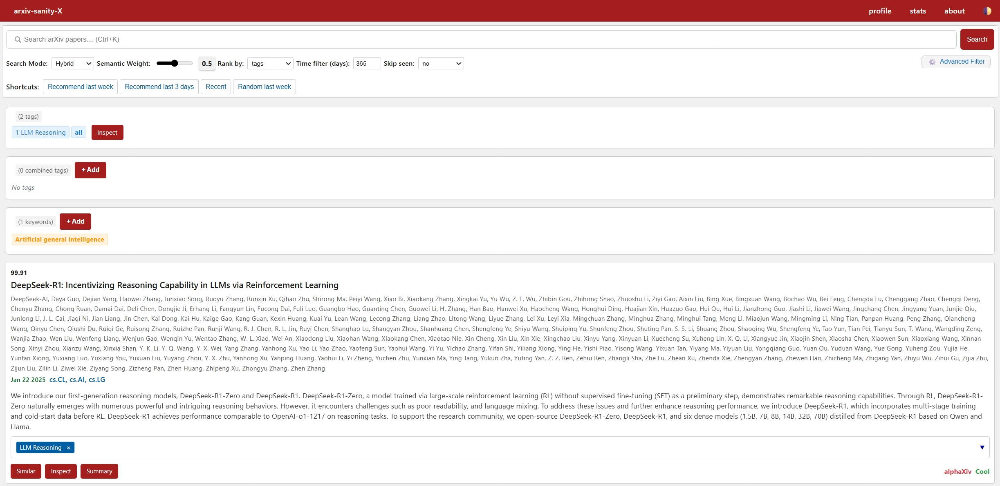

# arxiv-sanity-X

[中文](README_CN.md) | [English](README.md)

A powerful arXiv paper recommendation system built upon [arXiv-sanity-lite](https://github.com/karpathy/arxiv-sanity-lite) that significantly accelerates academic research workflows. This enhanced version features intelligent paper discovery through advanced machine learning techniques, personalized recommendation systems, and automated research tracking capabilities.



## 🚀 Key Features

### Core Functionality
- **Intelligent Paper Recommendations**: Hybrid feature system combining TF-IDF with modern embedding vectors, powered by SVM classifiers
- **Personalized Tagging System**: Individual and combined tag management for fine-grained interest tracking
- **Keyword Monitoring**: Automatic tracking of specified research keywords with real-time paper matching
- **Email Recommendation Service**: Daily personalized paper recommendations delivered to your inbox
- **Multi-dimensional Search**: Advanced search capabilities across titles, authors, abstracts, and more
- **Multi-logic Recommendations**: Support for AND/OR logic in tag combination recommendations
- **Time-based Filtering**: Focus on recent publications with configurable time windows

### Performance Optimizations
- **Multi-core Processing**: Parallel computation support utilizing all available CPU cores
- **Intel Extension Support**: Optional Intel scikit-learn extensions for accelerated machine learning

### Machine Learning Capabilities
- **Hybrid Feature Architecture**: Sparse TF-IDF features combined with dense embedding vectors
- **Modern Embedding Models**: Support for Qwen3 and other state-of-the-art embedding models
- **Dynamic Classifiers**: Per-tag SVM classifiers trained dynamically for personalized recommendations


##  Changelog

### v2.0 - Enhanced ML Features
- ✨ **New**: Hybrid TF-IDF + embedding vector features
- ⚡ **Performance**: Multi-core optimization and Intel extensions
- 🧠 **Smart Caching**: Intelligent feature cache management
- 📈 **Incremental Processing**: Efficient embedding generation
- 🎯 **Improved Algorithms**: Enhanced recommendation accuracy
- 🔧 **Better Error Handling**: Comprehensive logging and debugging

### v1.0 - Foundation
- 📚 arXiv paper fetching and storage
- 🏷️ User tagging and keyword systems
- 📧 Email recommendation service
- 🌐 Web interface and search functionality
- 🤖 SVM-based paper recommendations

## 📋 Table of Contents
1. [Installation & Setup](#installation--setup)
2. [Configuration](#configuration)
3. [System Architecture](#system-architecture)
4. [Usage Guide](#usage-guide)
5. [Advanced Features](#advanced-features)
6. [API Reference](#api-reference)

## 🛠 Installation & Setup

### System Requirements
- Python 3.8 - 3.11
- Recommended: SSD storage for database performance
- Memory: 8GB+ recommended for large datasets
- Optional: CUDA-capable GPU for embedding models

### Quick Installation

```bash
# Clone the repository
git clone https://github.com/xihuai18/arxiv-sanity-x
cd arxiv-sanity-x

# Install Python dependencies
pip install -r requirements.txt

# Optional: Install Intel extensions for performance boost
pip install scikit-learn-intelex
```

### Initial Setup

1. **Create Configuration**
```bash
cp vars_template.py vars.py
# Edit vars.py with your settings
```

2. **Generate Security Key**
```python
import secrets
print(secrets.token_urlsafe(16))
# Save output to secret_key.txt
```

3. **Initialize Database**
```bash
# Fetch initial paper data
python arxiv_daemon.py -n 50000 -m 1000

# Compute feature vectors
python compute.py --num 50000 --embed_dim 512

# Start web service
gunicorn -w 4 -b 0.0.0.0:5000 serve:app
```

## ⚙️ Configuration

### Primary Configuration (vars.py)
```python
# Database Configuration
DATA_DIR = "data"  # Use SSD path for optimal performance
HOST = "http://localhost:5000"  # Web service URL

# Email Service Configuration
from_email = "your_email@example.com"
smtp_server = "smtp.example.com"
smtp_port = 465  # SSL port (465) or TLS port (587)
email_username = "your_username"
email_passwd = "your_app_password"
```

### Advanced Parameters

#### Feature Computation (compute.py)
```bash
python compute.py \
  --num 50000 \              # Number of TF-IDF features
  --min_df 20 \              # Minimum document frequency
  --max_df 0.10 \            # Maximum document frequency
  --ngram_max 1 \            # Maximum n-gram size
  --use_embeddings \         # Disable embedding vectors
  --embed_model ./qwen3-embed-0.6B \  # Embedding model path
  --embed_dim 512 \          # Embedding dimensions
  --embed_batch_size 2048    # Batch size for embedding generation
```

#### Email Recommendations (send_emails.py)
```bash
python send_emails.py \
  -n 20 \                    # Papers per recommendation
  -t 2.0 \                   # Time window (days)
  -m 5 \                     # Minimum tagged papers per user
  --dry-run 0                # Set to 1 for testing without sending
```

## 🏗 System Architecture

### Component Overview
```
arxiv-sanity-X/
├── serve.py              # Flask web server & API
├── arxiv_daemon.py       # arXiv data fetching daemon
├── compute.py            # Feature computation (TF-IDF + embeddings)
├── send_emails.py        # Email recommendation service
├── daemon.py             # Scheduler for automated tasks
├── aslite/               # Core library
│   ├── db.py            # Database operations
│   └── arxiv.py         # arXiv API interface
├── templates/           # HTML templates
├── static/             # Static web assets
└── data/               # Data storage
    ├── papers.db       # Paper database
    ├── features.pkl    # Feature cache
    └── dict.db         # User data
```

### Data Flow Pipeline
1. **Data Ingestion**: [`arxiv_daemon.py`](arxiv_daemon.py) fetches papers from arXiv API
2. **Feature Processing**: [`compute.py`](compute.py) generates TF-IDF and embedding features
3. **Web Service**: [`serve.py`](serve.py) provides user interface and recommendations
4. **Email Service**: [`send_emails.py`](send_emails.py) delivers personalized recommendations

### Automated Scheduling

**Built-in Scheduler:**
```bash
python daemon.py
```

**Manual Cron Setup:**
```cron
# Fetch and compute features (weekdays 4 PM)
0 16 * * 1-5 cd /path/to/arxiv-sanity-x && python arxiv_daemon.py -n 5000 && python compute.py

# Send email recommendations (weekdays 6 PM)
0 18 * * 1-5 cd /path/to/arxiv-sanity-x && python send_emails.py -t 1.5

# Backup user data (daily 7 PM)
0 19 * * * cd /path/to/arxiv-sanity-x && git add . && git commit -m "backup" && git push
```

## 📖 Usage Guide

### User Interface Features

#### 1. Account Management
- **Login Required**: Full functionality requires user authentication
- **Profile Setup**: Configure email for recommendations in profile settings

#### 2. Paper Discovery
- **Keyword Search**: Search across titles, authors, and abstracts with optimized ranking
- **Tag-based Recommendations**: SVM-powered recommendations based on your tagged papers
- **Time Filtering**: Focus on papers from specific time periods
- **Similarity Search**: Find papers similar to a specific paper ID

#### 3. Organization System
- **Individual Tags**: Create personal tags for papers of interest
- **Combined Tags**: Register tag combinations for more sophisticated recommendations
- **Keyword Tracking**: Set up automatic monitoring for research keywords
- **Tag Management**: Rename, delete, and organize your tag system

#### 4. Recommendation Modes
- **Search**: Keyword-based paper discovery
- **Tags**: SVM recommendations based on tagged papers
- **Time**: Chronological browsing of recent papers
- **Random**: Serendipitous paper discovery

### Email Recommendations

Set up your email in the profile to receive:
- Daily recommendations based on your tags
- Keyword-matched paper alerts
- Combined tag recommendations
- Customizable recommendation frequency

## 🔧 Advanced Features

### Embedding Vector Integration

Support for modern embedding models like Qwen3:

```bash
# Download embedding model (example)
huggingface-cli download Qwen/Qwen3-Embedding-0.6B --local-dir ./qwen3-embed-0.6B

# Enable embedding computation
python compute.py --embed_model ./qwen3-embed-0.6B
```

### Performance Optimization

The system automatically optimizes for your hardware:
- **Multi-core Utilization**: Automatically detects and uses all CPU cores
- **Intel Extensions**: Optional acceleration with Intel scikit-learn extensions
- **Memory Management**: Intelligent caching and memory optimization

### Intelligent Caching

- **Automatic Reload**: Feature cache automatically updates when files change
- **Incremental Processing**: Only compute embeddings for new papers
- **Memory Database**: Papers loaded into memory for fast queries
- **Smart Cache Management**: Efficient cache invalidation and updates

## 📚 API Reference

### Core Endpoints

#### Search & Recommendations
- `GET /?rank=search&q=<query>` - Keyword search
- `GET /?rank=tags&tags=<tag_list>` - Tag-based recommendations
- `GET /?rank=time&time_filter=<days>` - Time-filtered papers
- `GET /?rank=pid&pid=<paper_id>` - Similar papers

#### Tag Management
- `GET /add/<pid>/<tag>` - Add tag to paper
- `GET /sub/<pid>/<tag>` - Remove tag from paper
- `GET /del/<tag>` - Delete tag
- `GET /rename/<old_tag>/<new_tag>` - Rename tag

#### Keyword Management
- `GET /add_key/<keyword>` - Add keyword for tracking
- `GET /del_key/<keyword>` - Remove keyword

#### System Information
- `GET /stats` - System statistics
- `GET /cache_status` - Cache status (authenticated users only)

### SVM Parameters

- **C parameter**: Regularization strength (default: 0.02)
  - Lower values = stronger regularization
  - Higher values = less regularization
- **Logic modes**:
  - `and`: All tags must be relevant
  - `or`: Any tag can be relevant
- **Time filtering**: Limit recommendations to recent papers (in days)

### Performance Optimization

1. **Use SSD Storage**: Set `DATA_DIR` to SSD path for faster I/O
2. **Adequate Memory**: 16GB+ RAM recommended for large datasets
3. **Intel Extensions**: Install `scikit-learn-intelex` for CPU acceleration
4. **Feature Tuning**: Adjust TF-IDF feature count based on dataset size
5. **Batch Processing**: Optimize batch sizes for your hardware

### Monitoring & Maintenance

```bash
# Check system status
curl http://localhost:5000/stats

# Monitor cache performance
curl http://localhost:5000/cache_status
```
