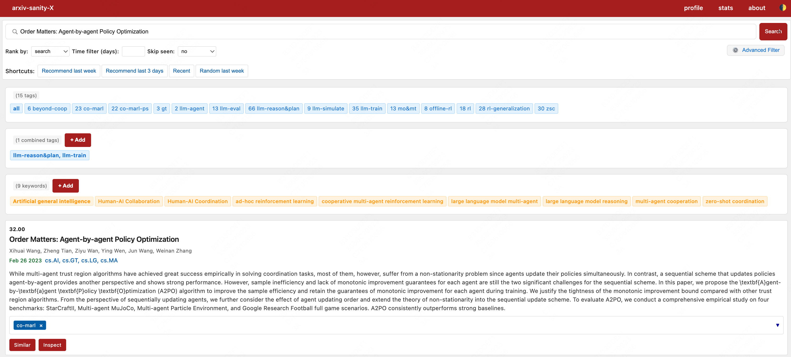

# arxiv-sanity-X

[中文](README_CN.md) | [English](README.md)

基于现代机器学习技术的综合性 arXiv 论文浏览和推荐系统，集成 AI 智能总结、混合搜索功能和个性化推荐。采用 TF-IDF、语义嵌入和 LLM 集成等先进技术。



## ⚡ 快速开始

```bash
# 1. 克隆并安装
git clone https://github.com/xihuai18/arxiv-sanity-x && cd arxiv-sanity-x
pip install -r requirements.txt

# 2. 配置
cp vars_template.py vars.py  # 编辑 vars.py 配置您的设置

# 3. 获取论文并计算特征
python3 arxiv_daemon.py -n 10000 -m 500
python3 compute.py --num 20000

# 4. 一键启动所有服务
python3 run_services.py

# 访问 http://localhost:55555
```

## 🚀 核心功能

- **🤖 AI 论文总结**：完整处理管道，包含 HTML（arXiv/ar5iv）解析或 `minerU` PDF 解析、LLM 总结和智能缓存系统
- **🔍 高级搜索引擎**：关键词、语义和混合搜索模式，支持可配置权重和智能时间过滤
- **🎯 智能推荐系统**：混合 TF-IDF + 嵌入特征，基于用户偏好训练动态 SVM 分类器
- **🏷️ 灵活组织管理**：个人标签、组合标签、关键词跟踪，支持 AND/OR 逻辑操作
- **📧 邮件智能服务**：自动化每日推荐，个性化 HTML 模板和假期感知调度
- **⚡ 高性能优化**：多核处理、Intel 扩展、增量更新、Ollama 嵌入 + minerU(vLLM) 和智能缓存
- **🔗 现代化架构**：RESTful API、响应式 Web 界面、异步总结加载和全面错误处理
- **🔄 完全自动化**：内置调度器管理 获取→计算→总结→邮件 流程，智能资源管理

## 📈 更新日志

### v3.0 - UI 重设计与 HTML 总结
- 🎨 **UI 改版**：关于、个人中心、统计页面现代化布局重设计
- 📄 **HTML 总结**：ar5iv/arxiv HTML 解析（比 PDF 更快，结构更好）
- 🤖 **模型选择**：总结页面支持多 LLM 模型切换和自动重试
- 🔍 **增强搜索**：键盘快捷键（Ctrl+K）、高级过滤器、无障碍改进
- 📊 **统计图表**：每日论文数量柱状图可视化
- 📦 **LiteLLM 模板**：`llm_template.yml` 含 OpenRouter 免费模型配置

### v2.4 - 多线程批量处理与服务完善
- ⚡ **并发优化**：真正的多线程并发论文总结处理
- 🔒 **线程安全**：文件级锁机制避免 minerU 解析冲突
- 📊 **统计增强**：详细的处理统计和失败原因分析
- 🔄 **重试机制**：智能重试失败的论文处理任务
- 📈 **进度跟踪**：实时进度条和处理状态显示
- 🔧 **配置优化**：支持多种 LLM 服务商（OpenRouter 免费模型、OpenAI 兼容 API）
- 📊 **服务集成**：完善的 Ollama 嵌入 + minerU(vLLM) 服务集成
- 🎨 **界面增强**：更好的响应式设计和 MathJax 数学公式支持
- 🛠️ **错误处理**：增强的异常处理和重试机制

### v2.3 - AI 论文总结系统
- ✨ **新功能**：完整的 AI 驱动论文总结系统，包含 [`paper_summarizer.py`](paper_summarizer.py)
- 🧠 **MinerU 集成**：使用 minerU 进行高级 PDF 解析，提供更好的文本提取和结构识别
- 📝 **总结界面**：新的 `/summary` 路由，支持异步加载和 markdown 渲染
- 🔧 **批量处理**：[`batch_paper_summarizer.py`](batch_paper_summarizer.py) 支持并行总结生成和线程安全
- ⚡ **智能缓存**：智能总结缓存，支持中文文本比例验证和质量控制
- 🎨 **界面增强**：新的总结页面设计，支持 MathJax 数学公式渲染
- 📊 **配置完善**：在 [`vars.py`](vars.py) 中添加 LLM API 配置

### v2.2 - 性能与稳定性改进
- ⚡ **性能提升**：增强统一数据缓存系统，支持智能自动重载和文件变更检测
- 🔧 **嵌入优化**：简化 [`compute.py`](compute.py) 中的嵌入生成管道，支持增量更新
- 📈 **调度器增强**：将获取频率从每日1次增加到每日4次（早6点、上午11点、下午4点、晚9点）
- 🛠️ **错误修复**：修复邮件推荐系统边界情况和空结果处理
- 🧠 **智能缓存**：统一论文和元数据缓存，支持自动文件变更检测
- 📊 **API 改进**：增强标签搜索 API，提供更好的错误处理和全面日志记录
- 🚀 **内存优化**：减少内存占用，提高大数据集查询性能

### v2.1 - API 与语义搜索
- ✨ **新功能**：语义搜索，支持关键词、语义和混合模式
- 🔗 **API 集成**：提供 RESTful API 端点用于推荐和论文总结
- 🚀 **嵌入支持**：使用 Ollama `/api/embed` 进行嵌入生成（支持 `dimensions`）
- 🎯 **增强搜索**：混合搜索的可配置语义权重（0.0-1.0）
- 🔧 **重构架构**：嵌入模型的 API 客户端实现，支持适当错误处理

### v2.0 - 增强机器学习功能
- ✨ **新功能**：混合 TF-IDF + 嵌入向量特征，支持稀疏-稠密矩阵拼接
- ⚡ **性能优化**：多核优化和 Intel scikit-learn 扩展
- 🧠 **智能缓存**：智能特征缓存管理，支持自动重载检测
- 📈 **增量处理**：高效嵌入生成，支持增量更新
- 🎯 **改进算法**：通过混合特征方法增强推荐准确性
- 🔧 **更好的错误处理**：全面的日志记录和调试功能

### v1.0 - 基础版本
- 📚 arXiv 论文获取和存储，使用 SQLite 数据库
- 🏷️ 用户标签和关键词系统，支持灵活组织
- 📧 邮件推荐服务，支持 HTML 模板
- 🌐 网络界面和搜索功能
- 🤖 基于 SVM 的论文推荐

## 📋 目录
1. [安装与设置](#安装与设置)
2. [配置](#配置)
3. [系统架构](#系统架构)
4. [使用指南](#使用指南)
5. [AI 论文总结](#ai-论文总结)
6. [高级功能](#高级功能)
7. [API 参考](#api-参考)
8. [部署指南](#部署指南)

## 🛠 安装与设置

### 系统要求
- **Python**：3.8 - 3.11
- **存储**：推荐 SSD 以获得数据库性能（高效处理 40 万+论文）
- **内存**：推荐 8GB+（大特征矩阵的最佳性能需要 16GB+）
- **GPU**：可选 CUDA 兼容 GPU 用于嵌入模型和 minerU PDF 解析
- **网络**：稳定的互联网连接，用于 arXiv API、LLM API 调用和邮件服务

### 快速安装

```bash
# 克隆仓库
git clone https://github.com/xihuai18/arxiv-sanity-x
cd arxiv-sanity-x

# 安装 Python 依赖
pip install -r requirements.txt

# 可选：安装 Intel 扩展以提升性能
pip install scikit-learn-intelex
```

### 初始设置

1. **创建配置文件**
```bash
cp vars_template.py vars.py
cp llm_template.yml llm.yml
# 编辑 vars.py 和 llm.yml 配置您的设置
```

2. **生成安全密钥**
```python
import secrets
print(secrets.token_urlsafe(16))
# 将输出保存到 secret_key.txt
```

3. **初始化数据库**
```bash
# 获取初始论文数据（CS 类别：AI、ML、CL 等）
python3 arxiv_daemon.py -n 50000 -m 1000

# 计算混合特征向量（TF-IDF + 嵌入）
python3 compute.py --num 50000 --embed_dim 512 --use_embeddings

# 启动网络服务
#（推荐）读取 vars.py 里的 `SERVE_PORT`，并支持 preload/worker 等调参
bash up.sh
```

## ⚙️ 配置

### 主要配置 (vars.py)

在 `vars.py` 中配置以下设置：

- **数据库配置**：数据存储路径和Web服务URL
- **邮件服务配置**：SMTP服务器设置，用于论文推荐邮件
- **LLM API 配置**：支持多种LLM服务商（OpenAI接口）
- **服务端口**：嵌入（Ollama）和 minerU（vLLM）服务的端口配置
- **总结 Markdown 来源**：选择 `html`（默认）或 `mineru`，并设置 HTML 来源顺序

项目支持多种LLM服务商，包括OpenRouter（推荐，提供大量免费模型）和其他OpenAI兼容API。

总结来源选择（启动网页时生效）：
```bash
# 默认：HTML -> Markdown（优先 ar5iv，其次 arxiv）
export ARXIV_SANITY_SUMMARY_SOURCE=html
export ARXIV_SANITY_HTML_SOURCES=ar5iv,arxiv

# 使用 minerU（PDF）解析
export ARXIV_SANITY_SUMMARY_SOURCE=mineru

# MinerU 后端（默认：pipeline）
export ARXIV_SANITY_MINERU_BACKEND=pipeline
# 或使用 VLM http-client 后端（需要启动 minerU OpenAI 兼容服务）
export ARXIV_SANITY_MINERU_BACKEND=vlm-http-client
```
说明：HTML 模式不依赖 minerU；若 `ARXIV_SANITY_MINERU_BACKEND=vlm-http-client`，需在 `MINERU_PORT` 启动 minerU 的 OpenAI 兼容服务。
说明：摘要与 HTML 缓存按 arXiv 版本（pidvN）区分，新版本会自动重新生成。

### 调度器环境变量

调度器守护进程（`daemon.py`）支持以下环境变量：

| 变量 | 默认值 | 说明 |
|------|--------|------|
| `ARXIV_SANITY_FETCH_NUM` | 1000 | 每个分类获取的论文数量 |
| `ARXIV_SANITY_FETCH_MAX` | 200 | 每次 API 请求的最大结果数 |
| `ARXIV_SANITY_SUMMARY_NUM` | 100 | 每次运行总结的论文数量 |
| `ARXIV_SANITY_SUMMARY_WORKERS` | 2 | 并行总结工作线程数 |
| `ARXIV_SANITY_DAEMON_SUMMARY` | 1 | 启用/禁用总结生成 (0/1) |
| `ARXIV_SANITY_DAEMON_EMBEDDINGS` | 1 | 启用/禁用嵌入计算 (0/1) |
| `ARXIV_SANITY_ENABLE_GIT_BACKUP` | 0 | 启用用户数据 git 备份 (0/1) |

### 高级参数

#### 特征计算 (compute.py)
```bash
python3 compute.py \
  --num 50000 \              # TF-IDF 特征数量
  --min_df 20 \              # 最小文档频率
  --max_df 0.10 \            # 最大文档频率
  --ngram_max 1 \            # 最大 n-gram 大小
  --use_embeddings \         # 启用嵌入向量（可选）
  --embed_model ./qwen3-embed-0.6B \  # 嵌入模型路径
  --embed_dim 512 \          # 嵌入维度
  --embed_batch_size 2048    # 嵌入生成批次大小
```

#### 批量论文总结 (batch_paper_summarizer.py)
```bash
python3 batch_paper_summarizer.py \
  -n 200 \                   # 处理论文数量
  -w 4 \                     # 工作线程数
  --max-retries 3 \          # 最大重试次数
  --no-skip-cached           # 重新处理已缓存论文
```

#### 邮件推荐 (send_emails.py)
```bash
python3 send_emails.py \
  -n 20 \                    # 每次推荐的论文数量
  -t 2.0 \                   # 时间窗口（天）
  -m 5 \                     # 每用户最少标记论文数
  --dry-run 0                # 设为 1 进行测试而不发送邮件
```

## 🏗 系统架构

### 组件概览
```
arxiv-sanity-X/
├── serve.py                    # Flask 网络服务器和 API
├── arxiv_daemon.py             # arXiv 数据获取守护进程
├── compute.py                  # 特征计算（TF-IDF + 嵌入）
├── send_emails.py              # 邮件推荐服务
├── daemon.py                   # 自动化任务调度器
├── paper_summarizer.py         # AI 论文总结模块
├── batch_paper_summarizer.py   # 批量论文总结处理
├── up.sh                       # Gunicorn 启动脚本
├── litellm.sh                  # LiteLLM 网关启动脚本
├── llm.yml                     # LiteLLM 配置文件
├── mineru_serve.sh             # minerU VLM 服务器启动脚本
├── embedding_serve.sh          # Ollama 嵌入服务器启动脚本
├── aslite/                     # 核心库
│   ├── db.py                  # 数据库操作（SQLite + 压缩）
│   └── arxiv.py               # arXiv API 接口
├── templates/                  # HTML 模板
│   ├── base.html              # 基础模板
│   ├── index.html             # 主界面模板
│   └── summary.html           # 论文总结页面模板
├── static/                     # 静态网络资源
│   ├── paper_list.js          # 主界面 JavaScript
│   ├── paper_summary.js       # 总结页面 JavaScript
│   └── style.css              # 样式表
└── data/                       # 数据存储
    ├── papers.db              # 论文数据库（SQLite）
    ├── features.p             # 特征缓存（pickle）
    ├── dict.db                # 用户数据（SQLite）
    ├── pdfs/                  # 下载的 PDF 文件
    ├── mineru/                # MinerU 解析内容
    ├── html_md/               # HTML->Markdown 缓存内容
    └── summary/               # 缓存的论文总结
```

### 数据流管道
1. **数据摄取**：[`arxiv_daemon.py`](arxiv_daemon.py) 从 arXiv API 获取论文（每日4次：早6点、上午11点、下午4点、晚9点）
2. **特征处理**：[`compute.py`](compute.py) 生成混合 TF-IDF + 嵌入特征，支持增量更新
3. **AI 总结**：[`paper_summarizer.py`](paper_summarizer.py) 获取 arXiv/ar5iv HTML（默认）或 PDF → Markdown 解析 → LLM 总结
4. **网络服务**：[`serve.py`](serve.py) 提供响应式 UI、混合搜索、推荐功能和异步总结加载
5. **邮件服务**：[`send_emails.py`](send_emails.py) 提供个性化推荐，支持假期感知调度
6. **自动化管理**：[`daemon.py`](daemon.py) 协调整个流程，支持智能资源管理

### 服务依赖关系
```
┌─────────────────┐    ┌──────────────────┐    ┌─────────────────┐
│   Flask Web     │    │ Ollama Embedding │    │  minerU VLM     │
│  (port 55555)  │<-->│   (port 51000)   │    │  (port 52000)   │
└─────────────────┘    └──────────────────┘    └─────────────────┘
         │                       │                       │
         │                       │                       │
         v                       v                       v
┌─────────────────────────────────────────────────────────────────┐
│                     SQLite 数据库存储                             │
│  papers.db | features.p | dict.db | summary/ | mineru/ | html_md/│
└─────────────────────────────────────────────────────────────────┘
```

## 📖 使用指南

### 用户界面功能

- **账户系统**：用户认证，支持个人资料管理和邮箱配置
- **高级搜索**：
  - **关键词搜索**：传统基于文本的搜索，使用 TF-IDF 评分
  - **语义搜索**：AI 驱动的相似性搜索，使用嵌入向量
  - **混合搜索**：结合关键词+语义，支持可调权重（0.0-1.0）
  - **标签推荐**：基于您的个人标签训练 SVM 推荐
  - **时间过滤**：智能过滤，即使在时间窗口外也保留已标记论文
- **组织工具**：
  - **个人标签**：单篇论文标记，支持 AND/OR 逻辑
  - **组合标签**：多标签分类（如 "RL,NLP"）处理复杂主题
  - **关键词跟踪**：跟踪所有论文中的特定术语
- **AI 论文总结**：
  - 点击"总结"获取 LLM 生成的总结
  - MathJax 渲染 LaTeX 公式
  - 异步加载和进度指示器
  - 缓存机制提升性能

### 邮件智能服务
- **每日推荐**：基于您的标签的个性化论文建议
- **关键词提醒**：当匹配您关键词的论文出现时通知
- **假期感知**：假期期间调整推荐频率
- **HTML 模板**：丰富的邮件格式，直接链接到论文

## 🤖 AI 论文总结

### 完整 AI 处理管道
1. **HTML/PDF 获取**：获取 arXiv/ar5iv HTML（默认）或 PDF，支持错误处理
2. **Markdown 解析**：HTML→Markdown（默认）或 minerU PDF 解析，支持结构识别
3. **LLM 处理**：使用多种兼容 OpenAI API 的模型生成全面总结
4. **质量控制**：中文文本比例验证和内容过滤
5. **智能缓存**：智能缓存机制，自动质量检查和存储优化

### 启动服务
```bash
# 一键启动（推荐，只需一个终端）
python3 run_services.py

# 可选：用 gunicorn 启动 Web
python3 run_services.py --web gunicorn

# 可选：不启动某些重服务（例如只跑 Web）
python3 run_services.py --no-embed --no-mineru --no-litellm

# 可选：启动时指定总结 Markdown 来源（默认：html）
python3 run_services.py --summary-source html
python3 run_services.py --summary-source mineru

# 可选：同时启动自动化调度器（fetch/compute/summary/email）
python3 run_services.py --with-daemon

# 一次性：跨所有分类抓取最新 N 篇，然后计算特征
python3 run_services.py --fetch-compute        # 默认 10000
python3 run_services.py --fetch-compute 1000   # 自定义 N
```

### 运行与性能开关（新增）

- `ARXIV_SANITY_CACHE_PAPERS=1`：把整张 `papers` 表常驻内存（更吃内存，但渲染更快）。默认 `0` 仅缓存 `metas/pids`，论文内容按需读取。
- `ARXIV_SANITY_WARMUP_DATA=0|1`、`ARXIV_SANITY_WARMUP_ML=0|1`：是否开启后台预热（每个 worker 懒启动；可安全配合 gunicorn `--preload`）。
- `ARXIV_SANITY_ENABLE_SCHEDULER=0|1`：是否在 Web 进程内启用 APScheduler 的缓存刷新任务。
- `ARXIV_SANITY_LOG_LEVEL=INFO|DEBUG|...`：Web 进程的日志等级（Loguru）。
- `up.sh`（gunicorn）：`GUNICORN_WORKERS`、`GUNICORN_THREADS`、`GUNICORN_EXTRA_ARGS`、`ARXIV_SANITY_GUNICORN_PRELOAD=0|1`。

前端已预编译（不再依赖浏览器端 Babel）。如需修改 `static/paper_list.js` 等源码后重新构建：
```bash
npm install
npm run build:static
```

常见问题：
- 如果看到 `No module named 'numpy._core'` / `features.p` 加载失败：说明特征文件由不同 NumPy 大版本生成。请升级到 NumPy 2.x 或在当前环境下重新运行 `python3 compute.py` 生成特征。

### 使用命令
```bash
# 单篇论文总结（Web 界面）
# 点击"总结"链接或访问：/summary?pid=<paper_id>

# 批量处理（最新论文）
python3 batch_paper_summarizer.py -n 100 -w 2

# 高级批量处理，自定义工作线程
python3 batch_paper_summarizer.py -n 200 -w 4 --max-retries 3

# 检查处理状态
python3 batch_paper_summarizer.py --dry-run  # 预览模式
```

### LLM 服务商支持
项目支持多种 LLM 服务商：

#### OpenRouter
```python
LLM_BASE_URL = "https://openrouter.ai/api/v1"
LLM_API_KEY = "sk-or-v1-..."
LLM_NAME = "deepseek/deepseek-chat-v3.1:free"  # 免费模型
```

#### OpenAI
```python
LLM_BASE_URL = "https://api.openai.com/v1"
LLM_API_KEY = "sk-..."
LLM_NAME = "gpt-4o-mini"
```

### 功能特性
- **MathJax 支持**：Web 界面中完整的 LaTeX 数学公式渲染
- **Markdown 输出**：丰富格式，包含标题、列表、代码块和数学表达式
- **异步加载**：非阻塞 Web 界面，支持进度指示器和实时更新
- **错误恢复**：自动重试机制，详细失败日志和优雅降级
- **线程安全**：并发处理，minerU 锁管理防止冲突
- **存储优化**：自动清理中间文件和智能缓存

## 🔧 高级功能

### 嵌入模型与性能
```bash
# 拉取并启动嵌入模型（Ollama）
ollama pull nomic-embed-text
bash embedding_serve.sh  # 使用 `ollama serve`，并强制 CPU-only

# 使用 API 客户端启用嵌入计算（Ollama /api/embed）
python3 compute.py --use_embeddings --embed_model nomic-embed-text --embed_api_base http://localhost:51000
```

功能特性：
- 多核处理优化
- Intel scikit-learn 扩展提升性能
- 智能特征缓存，支持自动重载
- 增量嵌入生成
- 稀疏-稠密矩阵拼接，实现混合特征

### 性能优化
- **数据库**：压缩 SQLite 存储，支持智能缓存
- **特征**：混合稀疏 TF-IDF + 稠密嵌入，支持 L2 归一化
- **内存**：针对大数据集（40万+论文）优化，支持流式处理
- **计算**：多线程处理，可配置工作池和批处理

### 自动化调度

**内置调度器：**
```bash
python3 daemon.py
```

**手动 Cron 设置：**
```cron
# 获取和计算特征（工作日每日4次）
0 9,13,17,21 * * 1-5 cd /path/to/arxiv-sanity-x && python3 arxiv_daemon.py -n 1000 && python3 compute.py --use_embeddings

# 发送邮件推荐（工作日下午 6 点）
0 18 * * 1-5 cd /path/to/arxiv-sanity-x && python3 send_emails.py -t 2

# 生成论文总结（每日晚上 7 点）
0 19 * * * cd /path/to/arxiv-sanity-x && python3 batch_paper_summarizer.py -n 200 -w 2

# 备份用户数据（每日晚上 8 点）
0 20 * * * cd /path/to/arxiv-sanity-x && ARXIV_SANITY_ENABLE_GIT_BACKUP=1 python3 -c "from daemon import backup_user_data; backup_user_data()"
```

## 📚 API 参考

### 核心端点

#### 搜索与推荐
- `GET /?rank=search&q=<query>` - 关键词搜索（TF-IDF 候选 + 面向论文的字段加权重排：标题/作者/分类更重要）
- `GET /?rank=search&q=<query>&search_mode=semantic` - 语义搜索，使用嵌入向量
- `GET /?rank=search&q=<query>&search_mode=hybrid&semantic_weight=<weight>` - 混合搜索，可配置权重
- `GET /?rank=tags&tags=<tag_list>&logic=<and|or>` - 基于标签的 SVM 推荐
- `GET /?rank=time&time_filter=<days>` - 时间过滤论文，智能标签保留
- `GET /?rank=pid&pid=<paper_id>` - 相似论文，使用最近邻搜索

**搜索语法（在同一个搜索框输入即可，无需改 UI）：**
- 字段过滤：`ti:`/`title:`（标题）、`au:`/`author:`（作者）、`abs:`/`abstract:`（摘要）、`cat:`/`category:`（分类）、`id:`（arXiv ID）
- 短语：`"diffusion model"`
- 排除词：`-survey` 或 `!survey`
- 多关键词：空格/逗号/顿号/分号/斜杠分隔均可，`AND`/`OR` 作为连接词会被忽略
- 技术名词：连字符/斜杠会被归一化（如 `self-supervised`、`rnn/lstm`）

示例：
- `ti:"graph neural network" cat:cs.LG`
- `au:goodfellow -survey`
- `id:2312.12345`

提示：直接粘贴完整论文标题也会优先匹配标题并尽量置顶；如果标题里包含较多标点/版本号，使用引号或 `ti:` 会更稳定。

#### API 端点
- `POST /api/keyword_search` - 通过 API 进行关键词搜索
- `POST /api/tag_search` - 单标签推荐
- `POST /api/tags_search` - 多标签推荐，支持逻辑操作
- `POST /api/get_paper_summary` - 获取 AI 生成的论文总结（JSON: `{"pid": "paper_id"}`）

#### 论文总结
- `GET /summary?pid=<paper_id>` - 查看 AI 生成的论文总结，支持异步加载和 MathJax

#### 标签管理
- `GET /add/<pid>/<tag>` - 为论文添加标签
- `GET /sub/<pid>/<tag>` - 从论文移除标签
- `GET /del/<tag>` - 删除标签（需要确认）
- `GET /rename/<old_tag>/<new_tag>` - 重命名标签，应用于所有论文

#### 关键词管理
- `GET /add_key/<keyword>` - 添加跟踪关键词
- `GET /del_key/<keyword>` - 从跟踪中移除关键词

#### 系统信息
- `GET /stats` - 系统统计和数据库信息
- `GET /cache_status` - 缓存状态和性能指标（需认证用户）

### SVM 参数与优化
- **SVM 配置**：C=0.02（正则化）、平衡类权重、LinearSVC 提升速度
- **逻辑模式**：`and`（加权组合）/`or`（联合）用于多标签查询
- **性能调优**：SSD 存储、16GB+ 内存、Intel 扩展、适当批次大小
- **监控**：通过 `/cache_status` 实时缓存统计和性能监控

### 搜索模式
- **关键词**：传统 TF-IDF，支持多核并行处理
- **语义**：使用预计算嵌入的余弦相似性
- **混合**：加权组合，支持归一化和可配置语义权重（0.0-1.0）

---

## 📝 许可证
本项目采用 MIT 许可证 - 详情请参见 [LICENSE](LICENSE) 文件。

## 🤝 贡献
欢迎贡献！请随时提交 Pull Request。

## ⭐ 致谢
- 原始 [arxiv-sanity-lite](https://github.com/karpathy/arxiv-sanity-lite) 项目，作者 Andrej Karpathy
- [minerU](https://github.com/opendatalab/MinerU) 提供高级 PDF 解析功能
- [Ollama](https://github.com/ollama/ollama) 提供本地嵌入服务
- [vLLM](https://github.com/vllm-project/vllm) 提供 MinerU VLM 服务
